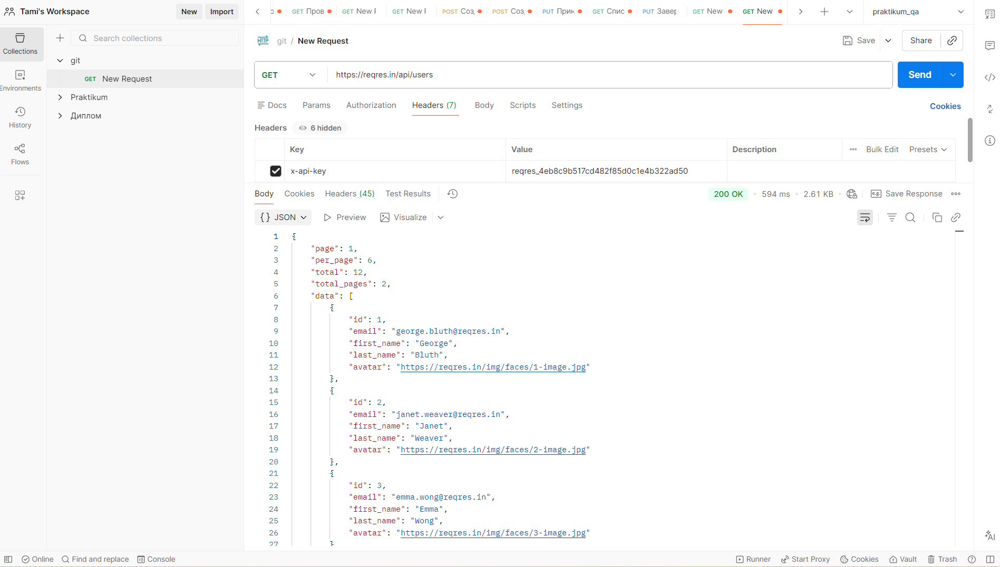
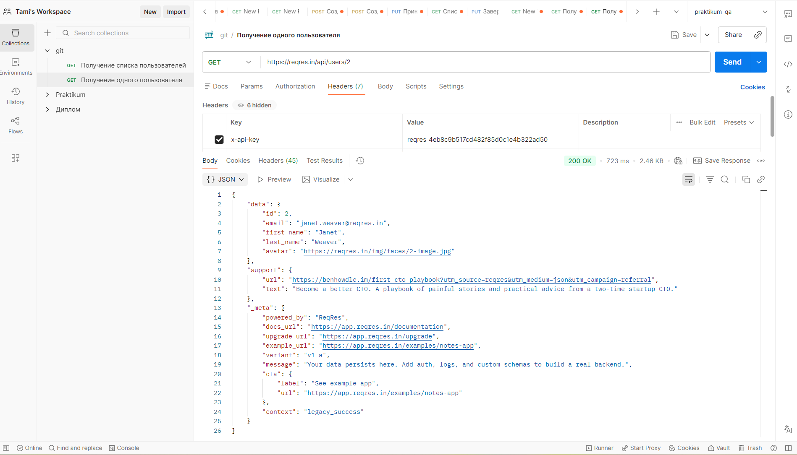
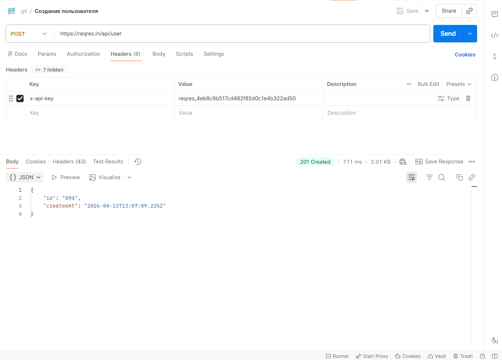
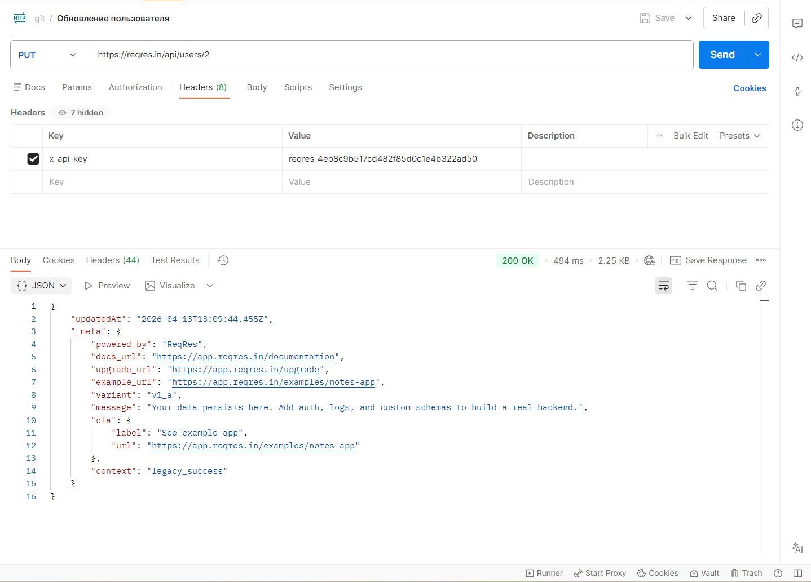
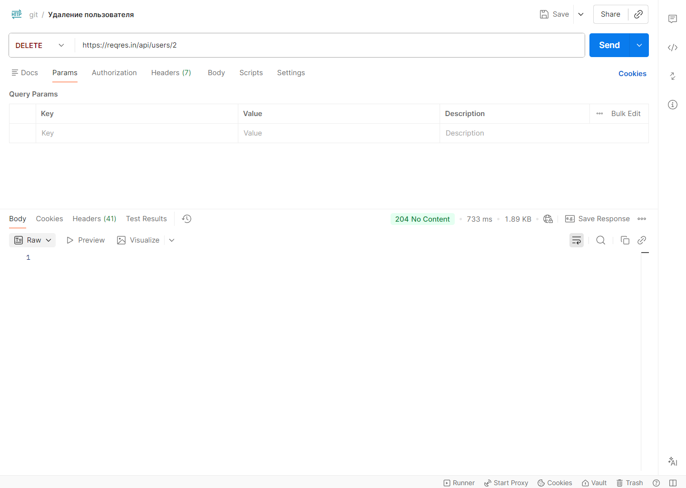
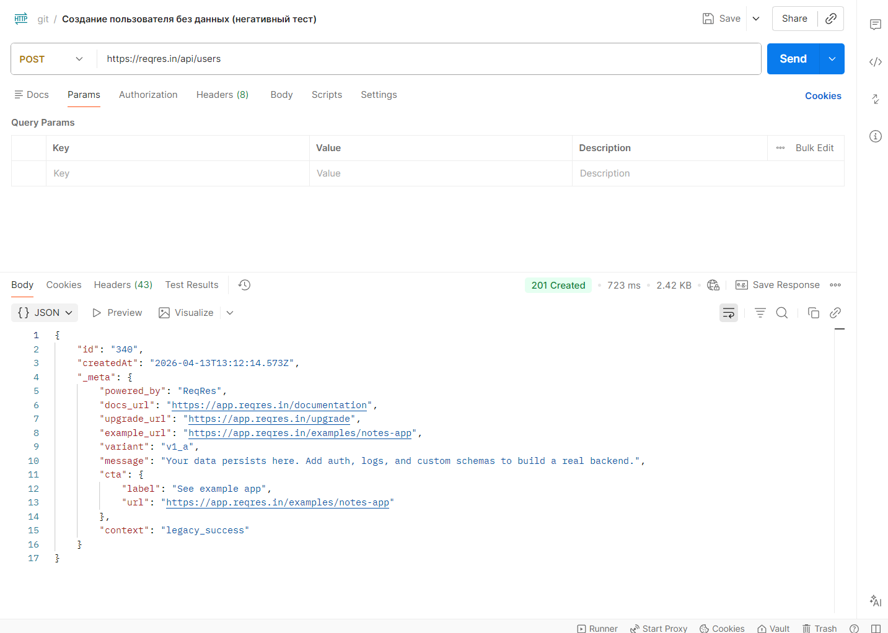

Create README.md
# QA API Testing Project

## 📌 Описание

Проект посвящён тестированию REST API с использованием Postman.
В рамках проекта были проверены основные CRUD операции и корректность работы сервера.

## 🧪 Что сделано

* Проведено тестирование API (GET, POST, PUT, DELETE)
* Проверены статус-коды и ответы сервера
* Написаны тест-кейсы
* Составлены баг-репорты
* Проверены позитивные и негативные сценарии

## 🛠 Инструменты

* Postman
* Swagger
* JSON

## 📂 Структура проекта

* `test_cases.md` — тест-кейсы
* `bug_reports.md` — баг-репорты
* `postman_collection.json` — коллекция запросов
* `screenshots/` — скриншоты тестирования

## 🎯 Результат

Получен практический опыт тестирования API, работы с документацией и выявления дефектов.

Ниже представлены примеры выполнения API-запросов в Postman:
## 📸 Примеры тестирования

### Получение списка пользователей (200)

### Получение одного пользователя (200)

### Создание пользователя (201)

### Обновление пользователя (200)

### Удаление пользователя (204)

### Негативный тест (баг)

